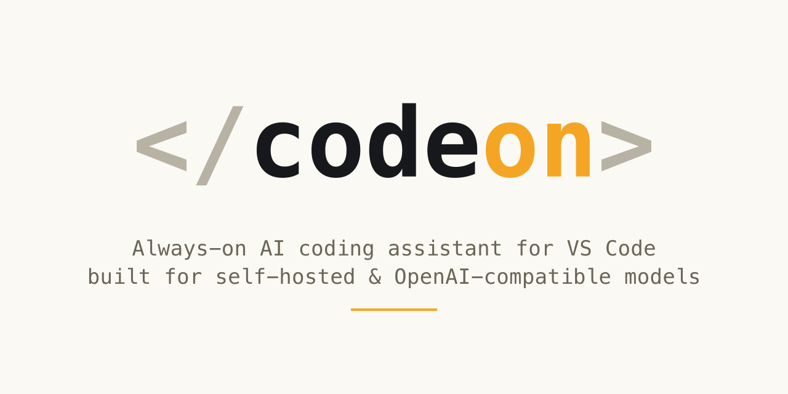

<p align="center">
  
</p>

<p align="center">
  <b>An always-on AI coding assistant for VS Code, built for your own self-hosted or OpenAI-compatible models.</b><br>
  Ollama, LiteLLM, vLLM, or any OpenAI-compatible endpoint — no vendor lock-in, no forced cloud dependency.
</p>

<p align="center">
  
  
</p>

---

## Why CodeOn

Most AI coding assistants tie you to one vendor's cloud API. CodeOn talks to **any OpenAI-compatible chat completions endpoint** — point it at a model you run yourself (Ollama on your laptop, a LiteLLM or vLLM gateway on your team's infra, or any hosted provider that speaks the same protocol) and get the same tool-calling, multi-file editing, and agentic workflow you'd expect from a cloud-only assistant, without your code ever having to leave infrastructure you control.

## Features

- **5 chat modes** — Plan, Build, Code Review, Debug, Research — each with a tailored system prompt for the task at hand
- **Full tool system** — file read/write/edit, git operations, process management, code intelligence (LSP, diagnostics, code actions), checkpoints (undo/redo across multi-step edits), and multi-agent orchestration for parallel sub-tasks
- **MCP integration** — connect to Model Context Protocol servers for additional tools and resources
- **Inline edits & autocomplete** — side-by-side diff preview for AI-proposed edits, plus ghost-text FIM autocomplete
- **Policy engine** — every tool call is risk-classified (R0–R5); anything beyond a safe read requires your approval by default, with configurable thresholds
- **Persistent conversations** — chats survive reloads, with automatic context summarization as conversations grow
- **Codebase-aware retrieval** — a lightweight local index (symbols, keywords, recency) feeds relevant context into requests automatically
- **Audit trail** — every tool invocation is logged locally with its risk class, outcome, and duration

## Getting Started

### 1. Install

**From the Marketplace** — search "CodeOn AI" in the Extensions view (`Ctrl+Shift+X` / `Cmd+Shift+X`).

**From source, for now:**
```bash
git clone https://github.com/srathan1/codeon.git
cd codeon
npm install
npm run compile
```
Open the folder in VS Code and press `F5` to launch an Extension Development Host with CodeOn loaded.

### 2. Connect a model

CodeOn needs at least one model provider configured before it can chat.

1. Open the **CodeOn** panel from the Activity Bar
2. Click the model dropdown at the top of the chat panel → **Add Model**
3. Fill in:
   - **Provider name** — anything you'll recognize (e.g. "Ollama", "Team LiteLLM")
   - **Endpoint** — your OpenAI-compatible chat completions URL, e.g. `http://localhost:11434/v1` for a local Ollama instance, or your LiteLLM/vLLM gateway's URL
   - **API key** — only if your endpoint requires one (local Ollama typically doesn't)
   - **Model name** and its **context window size**
4. Save, select the model from the dropdown, and start chatting

You can add multiple providers/models and switch between them at any time — useful for pairing a fast local model for autocomplete with a stronger model for the main chat.

### 3. Chat

Type a message and press **Enter** (`Shift+Enter` for a newline). Pick a mode from the dropdown depending on what you're doing — **Plan** for read-only exploration and design discussion, **Build** for making changes, **Debug**, **Code Review**, or **Research**. Attach files with the paperclip button when you need to point the model at something specific.

The first time a tool call needs to touch your filesystem, run a command, or do anything beyond reading, you'll be asked to approve it — see [Configuration](#configuration) to adjust how eager that approval gate is.

## Commands

Available via the Command Palette (`Ctrl+Shift+P` / `Cmd+Shift+P`):

| Command | Description |
|---|---|
| `CodeOn: New Chat` | Start a fresh conversation |
| `CodeOn: Edit with Selection` | Send the current selection to chat for editing |
| `CodeOn: Accept Diff` | Apply a pending inline edit |
| `CodeOn: Reject Diff` | Discard a pending inline edit |
| `CodeOn: Show Request Logs` | View structured request logs |
| `CodeOn: Index Info` | Show codebase index statistics |
| `CodeOn: Rebuild Index` | Force-rebuild the symbol index |
| `CodeOn: Run Smoke Tests` | Execute the built-in smoke test suite |
| `CodeOn: Reset Conversation` | Clear the current chat's context |

## Configuration

All settings live under **"CodeOn"** in VS Code Settings (`Ctrl+,` / `Cmd+,`). Model endpoint, API key, and context window are configured per-model via **Add Model** (see [Getting Started](#getting-started)), not here.

<details>
<summary><b>Sampling</b></summary>

| Setting | Default | Description |
|---|---|---|
| `temperature` | `0.7` | Sampling temperature (0 = deterministic, higher = more creative) |
| `topP` | `0.8` | Nucleus sampling top_p (0–1, lower = sharper focus) |
| `topK` | `20` | Top-k sampling (0 = disabled) |
| `presencePenalty` | `1.5` | Positive values encourage exploring new topics |
| `repetitionPenalty` | `1` | 1.0 = neutral, higher suppresses repeated tokens |
| `minP` | `0` | Minimum probability floor for token selection (0 = no floor) |

</details>

<details>
<summary><b>Chat & interaction</b></summary>

| Setting | Default | Description |
|---|---|---|
| `defaultMode` | `plan` | Default chat mode on startup |
| `openCodeEnabled` | `true` | Enable tool calling |
| `openCodeApiKey` | *(empty)* | OpenCode API key, if your setup requires one |
| `approvalThreshold` | `moderate` | Risk level (safe / moderate / dangerous) that requires approval |
| `interactionMode` | `ask` | `ask` (approve every tool), `autoedit` (auto-approve reads, prompt for edits), `relaxed` (only prompt for shell commands) |
| `assistantName` | *(empty)* | Display name for the assistant; empty = use the model's name |
| `autoSummarizeThreshold` | `75` | Auto-summarize when context usage exceeds this % (0 disables) |
| `toolOutputMaxChars` | `15000` | Max characters per tool result kept in context |

</details>

<details>
<summary><b>Commands</b></summary>

| Setting | Default | Description |
|---|---|---|
| `commandTimeout` | `30` | Timeout (seconds) for `execute_command` |
| `commandBlocklist` | `rm -rf, :(){ :|:};, mkfs, dd if=` | Patterns that block command execution outright |

</details>

<details>
<summary><b>Autocomplete</b></summary>

| Setting | Default | Description |
|---|---|---|
| `autocompleteEnabled` | `true` | Enable ghost-text autocomplete |
| `autocompleteModel` | *(empty)* | Dedicated model for autocomplete; empty = use the main model |
| `autocompleteDebounceMs` | `200` | Debounce delay before requesting a completion |
| `autocompleteContextLines` | `15` | Lines of prefix/suffix context sent per request |

</details>

<details>
<summary><b>Auto-verification</b></summary>

Runs diagnostics/typecheck/lint after file-modifying tool calls in Build/Debug mode and feeds the results back to the model for self-correction.

| Setting | Default | Description |
|---|---|---|
| `autoVerifyEnabled` | `true` | Enable auto-verification |
| `autoVerifyTimeout` | `60` | Max seconds across all verification steps |
| `autoVerifyLintCommand` | *(empty)* | Override the auto-detected lint command |
| `autoVerifyTestCommand` | *(empty)* | Override the auto-detected test command (tests are opt-in — too slow to run by default) |

</details>

<details>
<summary><b>Web search</b></summary>

Used by the `web_search` tool. Auto-detected from whichever API key is present if `searchProvider` is left empty.

| Setting | Default | Description |
|---|---|---|
| `searchProvider` | *(empty)* | Comma-separated providers to try: `brave`, `serper`, `searxng`, `duckduckgo` |
| `braveSearchApiKey` | *(empty)* | [Brave Search API](https://api.brave.com) key (free tier: 2000 queries/month) |
| `serperApiKey` | *(empty)* | [Serper](https://serper.dev) (Google) API key |
| `searxngUrl` | *(empty)* | Your SearXNG instance URL |

</details>

## Project Structure

```
src/
├── agents/          # Sub-agent loop for multi-agent orchestration
├── api/            # LLM API client, prompt building, tool-call parsing
├── context/         # Token counting, mode management
├── conversation/    # Message flow orchestration, compaction
├── edit/            # Inline edits, autocomplete
├── indexing/         # Codebase indexer, retrieval service
├── observability/    # Request logging, session stats
├── provider/         # Model provider management
├── storage/          # Chat persistence
├── tools/            # Tool system
│   ├── executors/    # Individual tool implementations
│   ├── toolRegistry.ts
│   ├── policyEngine.ts
│   └── riskModel.ts
├── webview/          # HTML template, message routing
└── test/             # Unit tests + smoke test runner
media/                # Webview UI (main.js, main.css, icons)
```

## Development

```bash
npm install
npm run compile   # tsc -p ./
npm run lint       # eslint src --ext ts
npm run test        # full test suite (VS Code Electron host)
```

Press `F5` in VS Code to launch an Extension Development Host for manual testing and debugging.

## License

[MIT](./LICENSE)
